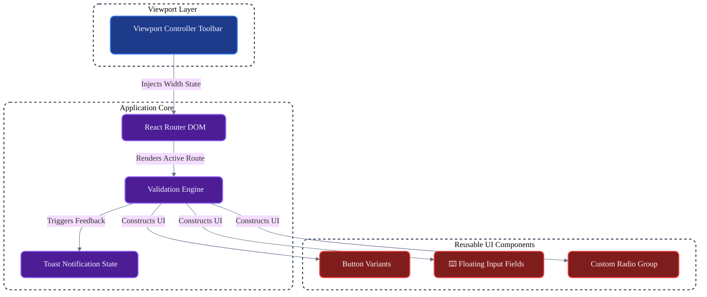

# 📱 PopX: Pixel-Perfect Mobile UI Engine

An enterprise-grade, responsive frontend interface designed to handle pixel-perfect UI replication, strict form validations, and user onboarding flows. Built with **React** and **Vite**, and styled strictly using pure CSS to enforce absolute layout precision.

---

## 🚀 Overview
PopX is an assessment project demonstrating the ability to translate static Adobe XD designs into dynamic, flawless web applications. It goes beyond a simple static page, acting as a robust frontend engine with stateful interactions, testing utilities, and dynamic viewport rendering.

### Core Intelligence
- **Fluid Viewport Architecture**: Dynamically shifts between a full-bleed mobile application view and a beautifully bordered floating desktop card based on the current user device.
- **Strict Human-in-the-Loop Validation**: Enforces rigorous client-side checks for Email structures, 10-digit Phone formats, and secure Password lengths before permitting submission.
- **Smart Developer Bypass**: A built-in "AutoPopulate Test Data" engine that allows reviewers to instantly fill the forms with correct dummy data (`Marry Doe`), bypassing manual entry entirely.

---

## ✨ Key Functionalities

### 1. Pixel-Perfect UX Replication
- **Design System Native**: Accurately maps the Adobe XD specifications to exact HEX codes, layout margins, and the `Rubik` font family.
- **Micro-Interactions**: Custom radio buttons, floating input labels with focus-state color transitions, and tactile button scaling `transform: scale(0.98)` for a premium feel.

### 2. High-Performance Architecture
- **Vite Build Engine**: Utilizes Vite for lightning-fast HMR (Hot Module Replacement) during development and highly optimized minified bundles for production.
- **Zero Heavy CSS Frameworks**: Built entirely using pure Vanilla CSS Custom Variables for maximum performance, overriding default browser styles without bloated external libraries.

### 3. Adaptive Intelligence
- **Viewport Testing Suite**: A custom floating toolbar built into the top of the UI that allows reviewers to instantly force the application into `Mobile (375px)`, `Tablet (768px)`, or `Responsive` mode.
- **Feedback Loop**: Integrated `react-hot-toast` to provide instant, stylish visual cues for errors, successes, and auto-fills.

---

## 🏗️ System Architecture

PopX strictly isolates routing, validation logic, and styling constraints.

## 🛠️ Setup & Installation
## Prerequisites

**• Node.js (v18+)**

**• Git CLI**

## 1. Local Setup

**Clone the repository and navigate to the root directory.**

### a) Clone the Repo
**git clone https://github.com/Indeevar05/Eduspace.git**
**cd Eduspace**

### b) Install dependencies
**npm install**

### c) Launch the Development Server:
**npm run dev**

#### Ensure the browser is pointed to http://localhost:5173 to view the application.

## 📱 Smart Feautures: 

**• Viewport Mode: Use the top toolbar to explicitly toggle between Mobile, Tablet, and Desktop views to verify structural integrity.**

**• Auto-Fill: Click the magical "Click to AutoPopulate Test Data" button above the auth forms to instantly bypass manual data entry.**

**• Authentication Flow: Attempt to submit invalid formats (like a 9-digit phone number) to trigger the strict form validations, then use valid data to seamlessly route to the Profile.**

**• Profile: Interact with the mock camera upload button and verify the mocked User Session data.**

**. Toast Notifications: Experience the Toast Notifications just to inform you that you did Right!**

## 🛡️ Developer Notes:
**• Styling Approach: All component styles are co-located alongside their `.jsx` files (e.g., `Button.css`, `InputField.css`) to enforce component-level scoping without resorting to CSS-in-JS.**

**• Routing: `BrowserRouter` handles all routing logic flawlessly without page reloads.**

---

## 👤 Author

### Indeevarashyam Mahanthi

### 📧 indeevarmsv@gmail.com

### 📁 Project: PopX Assignment Submission
